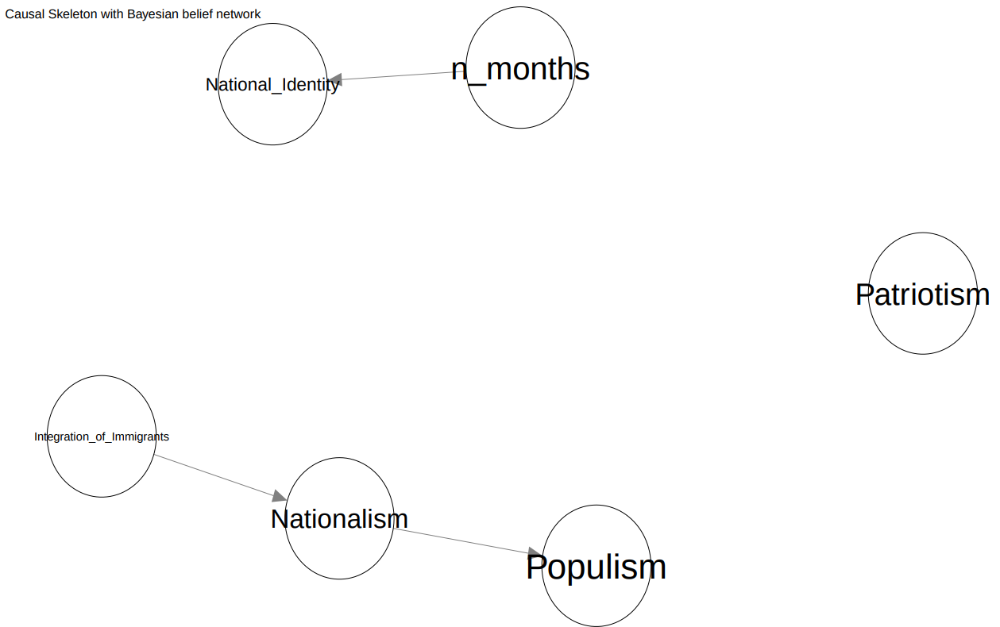
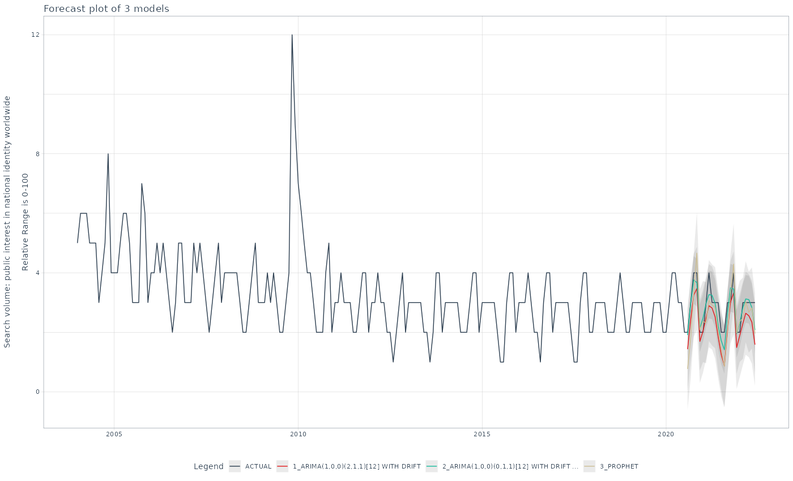
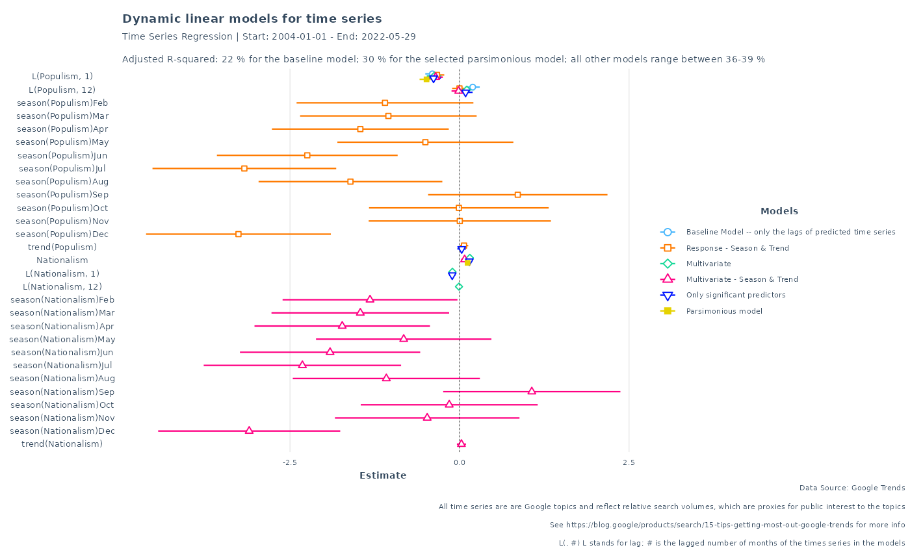
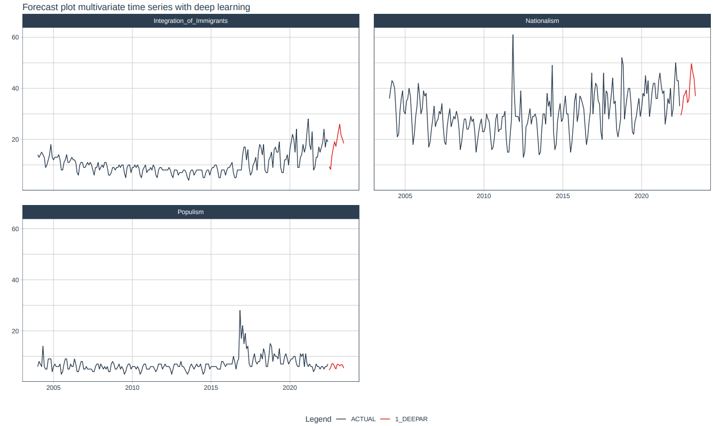

# Time series

Repo includes applications of univariate and multivariate times series.

Data comes from Google Trends. Google offers topics − a group of already clustered search terms that share the same concept or entity. These topics are language agnostic and also cover typical typos. Google topics are rough proxies for the public interest.

I pulled five interrelated ideologies (clustered as Google topics) and topics, namely nationalism, patriotism, populism, national identity, and integration of immigrants. Examining the relationship across topics and time reveals that some topics are better predicted as univariate time series; some can be modeled as multivariate dynamic relationships.

The graph below summarizes the finding: time passed determines public interest in national identity; public interest in the integration of immigrants determines public interest in nationalism, which in turn determines interest in populism.

I forecasted national identity with the best performing ML model (arima with xgboost errors).

I also investigated the multivariate relationship between populism, nationalism with a dynamic linear model.

Finally, I forecasted the three topics (integration of immigrants, nationalism, populism) with a deep learning times series framework.

